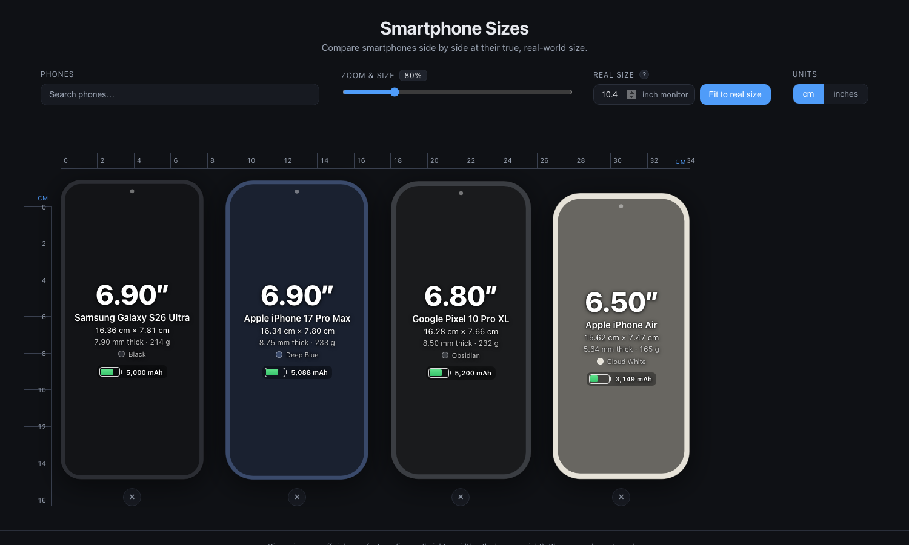

# Smartphone Sizes

Compare smartphones side by side at their **true, real-world size**. Pick any
phones from the database and see them drawn to scale next to each other, with
official dimensions, screen size, weight, battery, and signature colour.

No build step, no framework, no dependencies — just plain HTML, CSS, and
vanilla JavaScript. Open the file and it runs.



## Features

- **True-to-scale silhouettes** — each phone is drawn as an SVG using its real
  millimetre dimensions, so size differences are accurate at any zoom.
- **Accurate bezels** — the screen rectangle is computed from the official
  display diagonal and pixel aspect ratio, so each phone's real
  screen-to-body ratio (and chin) is reflected.
- **Search to add** — type to find phones across all brands; results exclude
  ones already on screen. Keyboard friendly (↑/↓, Enter, Esc).
- **Remove from the stage** — an `×` button sits under each phone.
- **Largest-first sorting** — phones are always ordered biggest → smallest,
  left to right, regardless of the order you added them.
- **Zoom & size slider** plus a **cm / inches** toggle. Horizontal and
  vertical rulers track the combined width and tallest height.
- **Fit to real size** — enter your monitor's diagonal once and the app sets
  the zoom so a phone held against the screen matches its on-screen drawing.
  The value is remembered (`localStorage`).
- **Shareable URLs** — the selected phones, zoom, and unit are mirrored into
  the query string, e.g.
  `?phones=iphone-17-pro-max,galaxy-s26-ultra&zoom=120&unit=in`. Copy the URL
  to reproduce the exact view.
- **On-phone spec overlay** — screen diagonal as a large headline, plus model
  name, dimensions, thickness, weight, colour, and a battery-shaped capacity
  indicator with a fill level relative to the largest battery in the database.

## Database

**37 phones across 7 brands:** Apple (11), Samsung (8), Google (8), OPPO (5),
Xiaomi (3), vivo (1), Honor (1).

Includes recent flagships such as the iPhone 17 / Air / 16 / 15 lines, Galaxy
S26 / S25 / S24 / S23 (and Z Fold7), Pixel 10 / 9 / 8, OPPO Find X9 series,
Xiaomi 17 series, Honor Magic8 Pro, and vivo X300 Ultra.

Dimensions, weight, display, resolution, and battery are taken from
manufacturers' official spec pages and cross-checked against reliable
references. A few notes:

- **Colours** (`accent` / `accentName`) are representative signature launch
  colourways — the one subjective field, easy to tweak.
- **Foldables** are shown in their **folded** (phone-mode) footprint; the
  Galaxy Z Fold7 uses its 6.5″ cover display.
- Where a model has region variants (e.g. China vs. global battery), the
  **global** figure is used.

## Run it

It's a static site. Any of these work:

```bash
# Option 1 — just open it
open index.html

# Option 2 — serve locally (recommended; some browsers restrict file://)
python3 -m http.server 8000
# then visit http://localhost:8000
```

## Project structure

| File          | Purpose                                                        |
| ------------- | ------------------------------------------------------------- |
| `index.html`  | Page markup and control bar                                    |
| `styles.css`  | All styling (dark theme)                                       |
| `phones.js`   | The phone database (`PHONES` array)                            |
| `app.js`      | Rendering, search, rulers, zoom, real-size calibration, URLs  |

## Adding a phone

Append an object to the `PHONES` array in [`phones.js`](phones.js). All fields
are required:

```js
{
  id: 'pixel-10-pro',          // unique, kebab-case (used in share URLs)
  brand: 'Google',
  name: 'Pixel 10 Pro',
  heightMm: 152.8,             // official body dimensions, in mm
  widthMm: 72.0,
  thicknessMm: 8.6,
  weightG: 207,                // grams
  screenInch: 6.3,             // display diagonal
  screenRes: [1280, 2856],     // native [width, height] in px (for bezel calc)
  batteryMah: 4870,
  cornerMm: 15,                // body corner radius, in mm (visual)
  accent: '#d9c7b8',           // signature colour (hex)
  accentName: 'Porcelain',
}
```

`screenInch` + `screenRes` together yield the real screen size in mm, which
drives the drawn bezel. Everything else (search, sorting, rulers, battery box,
share URL) picks the phone up automatically.

## Notes & limitations

- **Browsers can't read physical monitor size** (privacy), so true-size mode
  requires the one-time monitor-diagonal input. It also assumes the browser
  isn't page-zoomed.
- The phone graphics are clean SVG silhouettes tinted to each model's colour,
  not photos — better for a size tool since they're dimensionally exact and
  always load.
